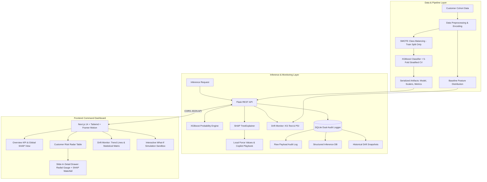

# 📡 Churn Radar — Explainable AI Churn Prediction & Retention Copilot

[](https://python.org)
[](https://xgboost.readthedocs.io)
[](https://shap.readthedocs.io)
[](https://docs.scipy.org/doc/scipy/reference/stats.html)
[](https://flask.palletsprojects.com)
[](https://nextjs.org)
[](https://tailwindcss.com)
[](https://framer.com/motion)

> **Portfolio Highlight**: *A production-grade, full-stack Machine Learning system that predicts customer churn, explains individual risk drivers using game-theoretic SHAP values, monitors production data drift using the Kolmogorov-Smirnov test and Population Stability Index (PSI), and provides a Command Dashboard for customer retention teams.*

---

## 🧭 Executive Summary

Most churn prediction demos stop at reporting generic test accuracy on static CSVs. In real production subscription businesses, three critical challenges break naive ML models:
1. **Black-box decisions are untrusted**: Account managers cannot intervene if they don't know *why* a customer is leaving.
2. **Severe Class Imbalance**: Most customers don't churn every month, meaning standard classifiers predict "Retained" 90% of the time while missing at-risk revenue.
3. **Data & Covariate Drift**: Customer behavior changes over time (new pricing, product outages, onboarding regressions), degrading model accuracy silently.

**Churn Radar solves all three**:
- **Explainability**: Every inference is paired with exact local **SHAP margin contributions**, a natural language narrative summary, and an actionable **Retention Playbook** mapped to the customer's top churn catalyst.
- **Production Rigor**: Mitigates class imbalance with **SMOTE** on training splits, optimizes hyperparameters via **Stratified 5-Fold Cross-Validation**, and evaluates on **ROC-AUC (0.866)**, **PR-AUC (0.634)**, Precision, Recall, and F1.
- **Statistical Drift Monitoring**: Tracks continuous and discrete distribution divergence against training baselines via two-sample **Kolmogorov-Smirnov tests** and **Population Stability Index (PSI)**.
- **Dual-Audit Logging**: Logs raw HTTP JSON payloads and structured prediction outcomes to SQLite for audit compliance and retraining datasets.
- **Executive Command Center**: A dark-mode dashboard built with **Next.js 14, TailwindCSS, and Framer Motion** with an interactive "What-If" simulation sandbox.

---

## 🏛️ System Architecture



---

## 🔬 Core Conceptual Pillars (For Technical Reviewers & Recruiters)

### 1. Explainable AI with SHAP (SHapley Additive exPlanations)
Standard feature importance (like Gini impurity or gain) only indicates what the model valued globally across the entire dataset. It does **not** explain why Customer `CR-1042` was assigned an 84% churn probability today.

Churn Radar implements **`shap.TreeExplainer`**, which computes exact Shapley values grounded in cooperative game theory:

$$\phi_i = \sum_{S \subseteq F \setminus \{i\}} rac{|S|!(|F| - |S| - 1)!}{|F|!} \left( f(S \cup \{i\}) - f(S) 
ight)$$

- **Local Margin Attribution**: Decomposes the model's log-odds output from the dataset expected value ($\mathbb{E}[f(x)]$) into additive contributions for each feature.
- **Risk Accelerators vs. Retention Anchors**: Visualizes factors pushing the customer toward churn (e.g. `+0.32` Month-to-Month Contract, `+0.28` 4 Support Tickets) counterbalanced by stabilizing anchors (e.g. `-0.18` 24 months tenure).
- **Automated Retention Playbook**: Dynamically matches the dominant positive SHAP contributor to a curated intervention (e.g. support ticket spikes trigger immediate VIP technical audits; month-to-month contracts trigger annual commit discounts).

---

### 2. Statistical Data Drift: KS-Test & PSI
Models silently decay in production as consumer behavior shifts. Churn Radar implements a dual statistical testing framework adapted from enterprise banking pipelines:

#### A. Population Stability Index (PSI)
Measures population shift between the baseline training distribution and current production inference windows across 10 quantile bins:

$$	ext{PSI} = \sum_{b=1}^{B} \left( 	ext{Actual}\%_b - 	ext{Expected}\%_b 
ight) 	imes \ln\left(rac{	ext{Actual}\%_b}{	ext{Expected}\%_b}
ight)$$

| PSI Threshold | Operational Status | System Action |
| :--- | :--- | :--- |
| **$	ext{PSI} < 0.10$** | 🟢 **STABLE** | Distributions match baseline; inference healthy. |
| **$0.10 \le 	ext{PSI} < 0.20$** | 🟡 **WARNING** | Moderate shift detected; flag feature for investigation. |
| **$	ext{PSI} \ge 0.20$** | 🔴 **CRITICAL** | Significant distribution drift; trigger retraining alert. |

#### B. Two-Sample Kolmogorov-Smirnov Test (KS-Test)
For continuous features (Tenure, Monthly Charges, Support Tickets, Inactivity), we calculate the supremum difference between empirical cumulative distribution functions:

$$D = \sup_x |F_{	ext{ref}}(x) - F_{	ext{curr}}(x)|$$

If $p < 0.05$ and $D \ge 0.12$, the feature is flagged for statistically significant divergence.

---

### 3. Class Imbalance Mitigation (SMOTE)
In subscription cohorts, churn is typically a minority event ($\sim 15	ext{--}25\%$). Training without adjustment causes models to converge on predicting non-churn.

- **SMOTE (Synthetic Minority Over-sampling Technique)** synthesizes minority instances along feature-space line segments connecting $k$-nearest neighbors.
- **Anti-Leakage Protocol**: SMOTE is fitted **exclusively on the training split** after stratified separation. The test set remains completely untouched and imbalanced to evaluate authentic real-world performance.

---

## 📊 Model Evaluation Performance

| Metric | Held-Out Test Set | Cross-Validation (5-Fold) |
| :--- | :---: | :---: |
| **ROC-AUC** | **0.8656** | **0.9627** |
| **PR-AUC (Average Precision)** | **0.6335** | — |
| **Accuracy** | **83.13%** | — |
| **Precision (Churn Class)** | **59.60%** | — |
| **Recall (Churn Class)** | **54.88%** | — |
| **F1-Score (Churn Class)** | **0.5714** | — |

*Evaluated on 800 unseen test customers with real-world class imbalance.*

---

## 🔌 Flask REST API Reference

| Method | Endpoint | Description |
| :--- | :--- | :--- |
| `POST` | `/predict` | Predict churn probability, risk tier, top SHAP drivers, and playbook. Writes dual logs to SQLite. |
| `GET` | `/explain/<customer_id>` | Returns full local SHAP waterfall values, narrative summary, and prescribed retention playbook. |
| `GET` | `/customers` | Paginated, sortable, filterable catalog of scored customers (`page`, `risk_tier`, `search`, `sort_by`). |
| `GET` | `/drift-report` | Current KS-Test / PSI scores across all features + historical timeline snapshots. |
| `POST` | `/simulate-drift` | Injects synthetic distribution drift (moderate/critical), evaluates against baseline, and records audit snapshot. |
| `GET` | `/metrics` | Model training metrics (ROC-AUC, confusion matrix, hyperparameters, feature importances). |
| `GET` | `/health` | Service health status, database connectivity, and record counts. |

### Example Inference Payload (`POST /predict`):
```json
{
  "customer_id": "CR-DEMO-01",
  "tenure_months": 2,
  "contract_type": "Month-to-Month",
  "monthly_charges": 92.50,
  "total_charges": 185.00,
  "support_tickets": 4,
  "last_login_days": 28,
  "monthly_usage_gb": 32.0,
  "payment_method": "Electronic Check",
  "paperless_billing": "Yes",
  "online_security": "No",
  "tech_support": "No",
  "num_products": 1
}
```

### Example Response:
```json
{
  "customer_id": "CR-DEMO-01",
  "churn_probability": 0.892,
  "risk_tier": "HIGH",
  "predicted_churn": 1,
  "explanation_summary": "High churn risk (89.2%) is predominantly driven by Recent Support Tickets (+1.10 impact), Days Since Last Login (+0.93 impact), Month-to-Month Contract (+0.85 impact).",
  "retention_playbook": {
    "title": "VIP Escalation & Account Health Audit",
    "urgency": "Immediate (Within 4 Hours)",
    "category": "Customer Success & Support",
    "action": "Assign Senior Solutions Engineer to review open tickets, schedule 15-minute executive check-in, and provide dedicated support channel.",
    "projected_impact": "+35% reduction in churn risk once unresolved tickets are cleared."
  },
  "latency_ms": 11.4
}
```

---

## 🚀 Getting Started

### Prerequisites
- **Python 3.11** (recommended via `uv` or standard Python 3.11)
- **Node.js 18+** & **npm**

---

### Step 1: Backend Setup & Model Training

```bash
# Navigate to backend
cd backend

# Create virtual environment (Python 3.11)
uv venv --python 3.11 .venv
# Or: python -m venv .venv

# Activate environment
# On Windows PowerShell:
.venv\Scriptsctivate
# On Linux/macOS:
# source .venv/bin/activate

# Install dependencies
pip install -r requirements.txt

# (Optional) Re-train the model and serialize artifacts
python model/train.py

# Initialize SQLite database and seed 500 pre-scored customers
python db.py

# Run unit and integration tests (13 test suites)
pytest -v

# Start Flask REST API server
python app.py
# API runs on http://127.0.0.1:5000
```

---

### Step 2: Frontend Setup & Development Server

```bash
# In a new terminal, navigate to frontend
cd frontend

# Install dependencies
npm install

# Build to verify TypeScript compilation
npm run build

# Start Next.js development server
npm run dev
# Dashboard runs on http://localhost:3000
```

---

## 📁 Repository Structure

```
churn-radar/
├── backend/
│   ├── app.py                     # Flask REST API with CORS and dual logging
│   ├── db.py                      # SQLite database schema, raw audit + structured prediction logger
│   ├── requirements.txt           # Python dependencies (xgboost, shap, imblearn, scipy, flask)
│   ├── model/
│   │   ├── preprocess.py          # Data transformers, encoders, scalers, SMOTE pipeline
│   │   ├── train.py               # XGBoost training with 5-fold CV and hyperparameter tuning
│   │   ├── explain.py             # SHAP TreeExplainer, plain-English generator, retention playbook
│   │   └── drift_monitor.py       # Two-sample KS-Test & PSI calculation module
│   ├── data/
│   │   ├── generate_data.py       # 4,000-record calibrated synthetic dataset generator
│   │   ├── churn_data.csv         # Complete dataset
│   │   └── churn_radar.db         # SQLite database with raw logs, predictions, and drift history
│   ├── artifacts/                 # Saved XGBoost model, preprocessor, metrics JSON, baseline CSV
│   └── tests/
│       ├── test_model.py          # Preprocessor, XGBoost, and SHAP tests
│       ├── test_drift.py          # KS-Test, continuous PSI, and categorical PSI tests
│       └── test_api.py            # Flask REST endpoints integration tests
├── frontend/
│   ├── app/
│   │   ├── layout.tsx             # Root layout with dark command center theme
│   │   ├── page.tsx               # Main dashboard orchestrating all views and state
│   │   └── globals.css            # Tailwind custom scrollbars, animations, radar pulse
│   ├── components/
│   │   ├── Navbar.tsx             # Header with animated radar sweep, tab navigation, API status
│   │   ├── MetricCard.tsx         # KPI card with trends and icons
│   │   ├── OverviewView.tsx       # Executive overview, global SHAP importance, risk breakdown
│   │   ├── CustomerTableView.tsx  # Sortable, filterable customer risk table with pagination
│   │   ├── CustomerDrawer.tsx     # Slide-in drawer with radial gauge, SHAP bar chart, and playbook
│   │   ├── DriftMonitorView.tsx   # Statistical drift matrix, historical PSI trend, simulation controls
│   │   └── SimulatorModal.tsx     # What-If customer simulation sandbox
│   ├── lib/
│   │   ├── api.ts                 # Typed fetch client connecting to Flask backend
│   │   └── types.ts               # TypeScript interfaces for predictions, SHAP, drift reports
│   ├── package.json
│   ├── tsconfig.json
│   └── tailwind.config.ts
└── README.md                      # Architecture & technical documentation
```

---

## 💡 Key Design Decisions

1. **Why SHAP over LIME?**
   LIME fits a local surrogate linear model around perturbed samples, which can be computationally non-deterministic and noisy. SHAP TreeExplainer leverages the tree structure of XGBoost to compute exact Shapley values in polynomial time with guaranteed mathematical efficiency and consistency.

2. **Why Both KS-Test and PSI?**
   - **PSI** assesses overall bucketed distribution shifts across 10 quantile bins and yields a single, standardized business metric ($<0.10$ stable, $>0.20$ critical).
   - **KS-Test** provides a non-parametric hypothesis test with rigorous $p$-values that do not depend on arbitrary binning boundaries, ensuring sensitivity to localized shifts.

3. **Why Dual-Audit Logging?**
   In financial and regulated SaaS domains, model compliance requires auditing the exact raw byte payload transmitted over HTTP (to investigate parsing bugs or malicious inputs), as well as indexed structured columns for immediate SQL aggregation, reporting, and automated retraining pipelines.

---

## 👨‍💻 Author & Portfolio Note
Built as an end-to-end showcase of production Machine Learning engineering, explainability, statistical data monitoring, and modern reactive frontend design.